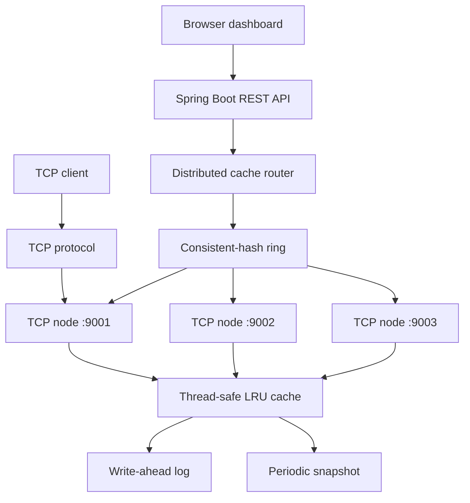

# Distributed In-Memory Cache

[](https://openjdk.org/projects/jdk/17/)
[](https://spring.io/projects/spring-boot)
[](https://maven.apache.org/)

A Java 17 distributed cache prototype that combines a thread-safe, TTL-aware LRU cache with a Spring Boot control plane and a lightweight TCP data plane. It is designed as a hands-on exploration of the engineering ideas behind systems such as Redis and Dynamo-style caches: partitioning, replication, recovery, concurrent access, and observability.

> **Portfolio summary:** Built a multi-node in-memory cache in Java with consistent-hash routing, primary/replica writes, concurrent replica reads, LRU eviction, TTL cleanup, write-ahead logging, snapshot recovery, and a Spring Boot dashboard/API.

## Highlights

- **O(1) LRU cache:** `ConcurrentHashMap` lookup backed by a doubly linked list for recency ordering and eviction.
- **Concurrent access:** Uses a `ReentrantReadWriteLock` around linked-list mutations, plus atomic counters for cache metrics.
- **TTL support:** Entries can expire; a scheduled cleaner removes expired keys and expiration metrics are recorded.
- **Distributed routing:** A consistent-hash ring with 100 virtual nodes per cache node maps keys across three TCP endpoints.
- **Replication-aware operations:** Writes are sent to a primary and its next ring node; reads issue requests to both replicas and compare timestamp versions.
- **Durable recovery:** Every mutation is appended to a write-ahead log (WAL). Periodic snapshots are written through a temporary file, then the WAL is compacted; startup restores the snapshot and replays the log.
- **Developer experience:** REST API, browser dashboard, raw TCP command protocol, statistics endpoint, and unit tests for cache, server, and snapshot behavior.

## Architecture



### Request lifecycle

```text
Write:  REST request → hash key → primary + next ring node → TCP PUT → WAL → LRU cache
Read:   REST request → hash key → concurrent primary/replica GET → compare versions → return value
Restart: snapshot load → WAL replay → cache ready
```

## Tech Stack

| Area | Technology |
| --- | --- |
| Language & runtime | Java 17 |
| Application layer | Spring Boot 3.2.5, Spring Web |
| Build & tests | Maven, JUnit 5 |
| Networking | Java sockets / TCP |
| Concurrency | `ConcurrentHashMap`, `ReentrantReadWriteLock`, executors, atomics |
| Persistence | File-backed WAL and snapshots |
| UI | Static HTML, Tailwind CSS (CDN) |

## Run Locally

### Prerequisites

- JDK 17+
- Maven 3.8+

### 1. Build and test

```bash
mvn clean test
```

### 2. Start a local three-node cluster

Open three terminals from the repository root. Each process exposes a dashboard/REST API and starts its TCP cache server on the paired TCP port.

```bash
# Terminal 1
mvn spring-boot:run -Dspring-boot.run.arguments="--server.port=8081 --cache.tcp.port=9001"

# Terminal 2
mvn spring-boot:run -Dspring-boot.run.arguments="--server.port=8082 --cache.tcp.port=9002"

# Terminal 3
mvn spring-boot:run -Dspring-boot.run.arguments="--server.port=8083 --cache.tcp.port=9003"
```

Open [http://localhost:8081](http://localhost:8081) to use the dashboard. The router is configured with `localhost:9001`, `localhost:9002`, and `localhost:9003` in `DistributedConfig`.

### 3. Exercise the API

```bash
# Store a value
curl -X POST "http://localhost:8081/cache?key=user:42&value=Anuj"

# Retrieve it
curl "http://localhost:8081/cache/user:42"

# Inspect configured cluster members
curl "http://localhost:8081/cache/cluster"

# Delete it
curl -X DELETE "http://localhost:8081/cache/user:42"
```

## API Reference

| Method | Endpoint | Description |
| --- | --- | --- |
| `POST` | `/cache?key={key}&value={value}` | Writes a value through the distributed router. |
| `GET` | `/cache/{key}` | Reads a value; returns `404` when it is absent. |
| `DELETE` | `/cache/{key}` | Deletes the key on the primary and replica routes. |
| `GET` | `/cache/cluster` | Lists the configured TCP node addresses. |

Example successful read:

```json
{
  "status": "SUCCESS",
  "key": "user:42",
  "value": "Anuj"
}
```

## TCP Protocol and Metrics

Each node accepts line-delimited commands on its configured `cache.tcp.port`:

```text
PUT <key> <value>
GET <key>
DELETE <key>
STATS
```

`STATS` reports hits, misses, hit rate, evictions, expirations, uptime, capacity, and current size. This is especially useful for testing the cache engine independent of the REST layer.

## Design Notes

### Cache engine

- A hash map provides key lookup; a doubly linked list maintains most- and least-recently-used order.
- At capacity, the tail node is evicted. Updates and successful reads move the relevant node to the head.
- TTL metadata is stored with each entry. A background worker scans once per second and removes expired entries.

### Distribution and consistency

- Keys are placed by a `TreeMap`-backed consistent-hash ring. Virtual nodes improve key distribution across physical nodes.
- A write is attempted against the selected primary and the next ring entry, and succeeds when at least one node acknowledges it.
- Reads are submitted concurrently to the primary and replica. The router uses timestamp versions embedded in distributed writes to select the latest response and attempts a repair when versions differ.

### Persistence and recovery

```text
mutation → append WAL → update cache
every 30 seconds → write temporary snapshot → replace snapshot → clear WAL
startup → load snapshot → replay WAL
```

## Project Layout

```text
src/
├── main/java/com/anuj/cache/
│   ├── api/           # Spring Boot app, REST controller, lifecycle configuration
│   ├── client/        # TCP client and benchmark scaffold
│   ├── core/          # Cache interface, LRU implementation, entries, metrics
│   ├── distributed/   # Hash ring, router, TCP client, health tracker
│   ├── persistence/   # WAL and snapshot managers
│   └── server/        # TCP cache server and command handling
├── main/resources/
│   └── static/        # Browser dashboard
└── test/              # JUnit tests
```

## Test Coverage

The included test suite covers:

- Cache `put`, `get`, update, delete, capacity eviction, and TTL expiration
- TCP command handling and server statistics
- Snapshot save/load recovery

Run it with:

```bash
mvn test
```

## Current Scope

This is an educational, single-machine distributed-systems prototype—not a production cache. A few implementation boundaries are intentionally worth calling out:

- Cluster membership is statically configured for three localhost nodes; there is no discovery or rebalancing workflow.
- Persistence files use default local paths, so separate node processes launched from the same directory share them. Isolate each node’s working directory before using the project for durable multi-node experiments.
- TTL is available in the core cache API but is not yet exposed through the REST or TCP command interfaces.
- The health tracker and benchmark scaffold establish extension points; production-grade failure detection, configurable timeouts, and validated benchmark results remain future work.

## Next Steps

- Add dynamic membership, node-specific persistence paths, and replication-factor configuration.
- Expose TTL and per-node metrics through the REST API.
- Add integration tests for node loss, recovery, replication, and read repair.
- Introduce a binary-safe wire format, structured logging, metrics export, and load-test automation.

## Why This Project

Rather than treating caching as a black box, this project implements the trade-offs behind it: local performance versus durability, replication versus consistency, and concurrent reads versus shared mutable state. It is a compact demonstration of practical Java backend and distributed-systems fundamentals.
